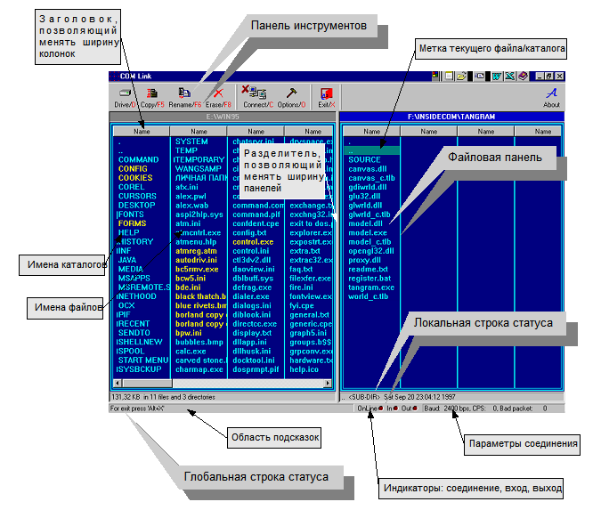

## COM-Link

COM-Link - это утилита обеспечивающая связь между двумя персональными вычислительными системами через последовательный асинхронный адаптер с помощью нуль-модемного кабеля и позволяющая выполнять минимальный набор базовых операций с файловой системой удалённой ЭВМ.  Помимо своей основной задачи - связи и передачи данных - утилита может просто функционировать как оболочка файлового процессора.

>[Полная документация](./ZAP/NET_ZP.DOC) 
>[Исполняемые файлы Win32](https://github.com/alexf2/Nets2/releases/download/Release1/Nets2Release.zip)

В данном проекте разработан пакет прикладных программ для обеспечения связи между двумя ПЭВМ через последовательный асинхронный интерфейс RS232 для платформы Win32 в среде Windows 95. Содержит оболочку файлового процессора с минимальным набором операций выполняемых над группами файлов и каталогов с поддеревьями каталогов. Реализует симметричную (с точки зрения пользователя) схему соединения и дуплексный режим передачи данных. Содержит защиту передаваемых данных с помощью CRC и циклического кода с полиномом X^3+X+1 и средства самовосстановления при ошибках. Разработанный пакет состоит из exe модуля и двух DLL библиотек. Исходные материалы содержат для: 32 cpp файл(367кб), 31 hpp(80кб) файла, 3 файлов(21кб) текстовых ресурсов(dlg, rc), 16 bmp(315кб) файла, 1 img(64кб) файлов, 4 ico(4кб) файла, 1 cur(326б) файлов. Пояснительная записка содержит: 41 листов, 3 таблиц, 10 рисунков. Приложения с листингами и полученными изображениями занимают 8 страниц. Для разработки проекта использовано 13 книг и журналов.
